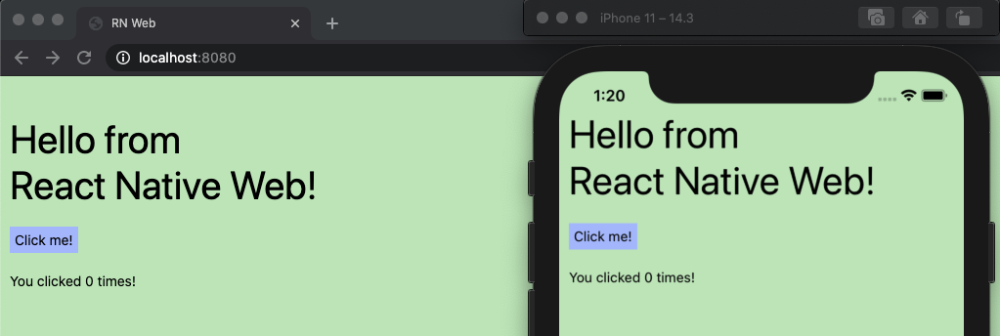
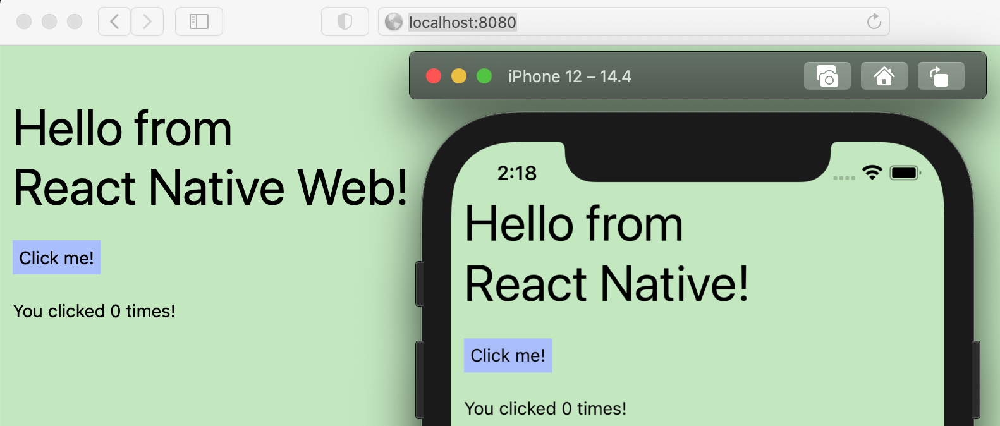

README last updated 27-July-21

# Introduction

This repo is a companion to the excellent Medium article ["How to add React Native Web to an existing React Native project"](https://arry.medium.com/how-to-add-react-native-web-to-an-existing-react-native-project-eb98c952c12f), by [Aryan Goharzad](https://arry.medium.com), demonstrating the steps in the _Adding React Native Web to a React Native init project_ section of his article.

## Initial commit of a Typescript React Native app

```sh
npx react-native init MyApp --template react-native-template-typescript
```

## Setting up React Native Web

Each of these steps are their own commits in this repository.

**Step 1**: Add React Native Web package dependencies:

```sh
yarn add react-native-web

yarn add -D babel-plugin-react-native-web webpack webpack-cli webpack-dev-server html-webpack-plugin react-dom babel-loader url-loader @svgr/webpack
```

**Step 2**: Add [index.html](https://gist.github.com/arrygoo/81d95ecc55313a7d0668f6711cfc7ff9#file-index-html)

**Step 3**: Add [index.web.js](https://gist.github.com/arrygoo/81d95ecc55313a7d0668f6711cfc7ff9#file-index-web-js)

**Step 4**: Add [webpack.config.js](https://gist.github.com/arrygoo/81d95ecc55313a7d0668f6711cfc7ff9#file-webpack-config-js)

**Step 5**: Add [App.web.tsx]()
Per the article *"This file is a temporary addition to verify that our setup is working before migrating the rest of the app to React Native web. Eventually, you can remove this file, and have a shared App.tsx that runs on both web and mobile."*

**Step 6**: Add this to `package.json`:

```json
"build": "rm -rf dist/ && webpack --mode=production --config webpack.config.js",
    "web": "webpack serve --mode=development --config webpack.config.js"
```

## Run the app on iOS, Android, and web

The article states, "Once you’ve confirmed that your React Native Web setup is working for the very simple component above, you can gradually add your app components to App.web.tsx and test them until all of your apps are ported to the web."

Issuing `yarn run web` now brings up the web app. And issuing `npx react-native run-ios` and `npx react-native run-android` brings up the app on mobile too, confirming that things are setup and ready for adding our own app compoents.

You'll see that the "Hello from React Native Web!" pages appears at http://localhost:8080 and the default `App.tsx` getting started screen for React Native appears on mobile.

## Sharing the same React Native web page with React Native app

This part wasn't covered in the article, but should have been (the article's screen shots show this result, but it wasn't covered as a step.

**Step 7**: Go ahead now and rename the temporary "App.web.tsx" file to "App.tsx", overwriting the default getting started screen for React Native. Change `webpack.config.js`'s `babelLoaderConfiguration` over to this:

```js
  include: [
    path.resolve(__dirname, 'index.web.js'), // Entry to your web application
    path.resolve(__dirname, 'App.tsx'), // App.web.tsx or App.tsx
    path.resolve(__dirname, 'src'),
    ...compileNodeModules,
  ],
```

Which tells webpack to use `App.tsx` for both web and mobile.

Now when you run on mobile, you'll see the same UI come up as does on web, which now matches the final screen shot in the article:



### Taking a small extra step: `Platform` example

I'll admit I twitched a tiny bit while looking at the above screen shot taken from the article. I thought "Saying React Native Web is running on mobile? That's not exactly right." So, taking a page from [Multi-platform setup](https://necolas.github.io/react-native-web/docs/multi-platform/) in the React Native Web documentation, I had the screen's "Hello" message be platform aware, like so:

```ts
const rnType = Platform.OS === 'web' ? 'React Native Web' : 'React Native';
```

Resulting in this "non-twitching" outcome :-), walla:


